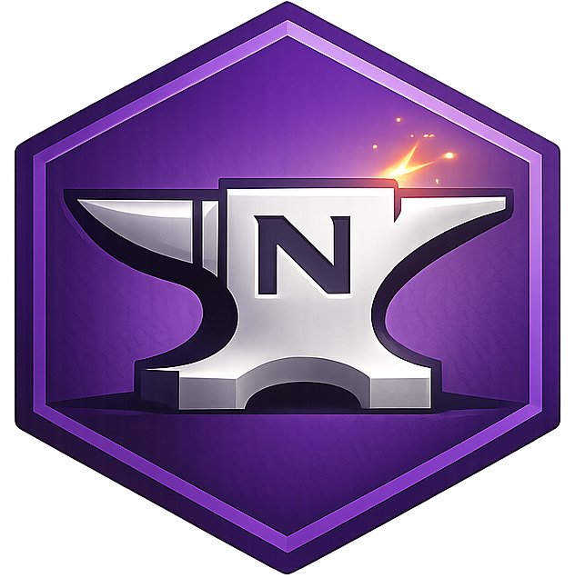

<p align="center">
   
</p>

<p align="center">
   <a href="https://github.com/thomaslaich/smithy-dotnet/actions/workflows/ci.yml">
      
   </a>
   <a href="https://thomaslaich.github.io/smithy-dotnet/">
      
   </a>
   <a href="https://www.nuget.org/packages/NSmithy.Client">
      
   </a>
   <a href="https://dotnet.microsoft.com/">
      
   </a>
   <a href="LICENSE">
      
   </a>
</p>

> **Work in Progress:** NSmithy is a proof of concept. Protocol implementations are not yet on par with the [Smithy reference implementations](https://github.com/smithy-lang/smithy).

# NSmithy

NSmithy is a preview-stage .NET toolkit that turns a [Smithy](https://smithy.io) model into idiomatic C# at build time. From a single contract you get typed clients, server scaffolding, and shared model types — fully integrated into your MSBuild workflow.

**[smithy.io](https://smithy.io)** · **[Documentation](https://thomaslaich.github.io/smithy-dotnet/)** · **[Design docs](designs/README.md)**

## Features

- **MSBuild integration**: Generate C# models, typed clients, and ASP.NET Core server stubs from a Smithy IDL as part of `dotnet build` — no separate codegen step.
- **Protocol support**: Implements `alloy#simpleRestJson`, `aws.protocols#restJson1`, `aws.protocols#restXml`, and `smithy.protocols#rpcv2Cbor`.
- **Conformance-tested**: Validated against official Smithy, AWS, and alloy conformance suites.

## Development

The recommended way to work on this repo is with [Nix](https://nixos.org/) (preferably [Determinate Nix](https://determinate.systems/nix/)) and [devenv](https://devenv.sh/).

1. **Install Nix** (recommended: [Determinate Nix](https://determinate.systems/nix/)) and [devenv](https://devenv.sh/).
2. **Optionally install [direnv](https://direnv.net/)** to activate the dev environment automatically when entering the directory (`direnv allow`). Without it, run `devenv shell` manually.
3. **Use the `just` recipes** to build, test, and package:

   ```bash
   just          # list all available recipes
   just build    # build the codegen JAR and .NET solution
   just test     # run the test suite
   just fmt      # format all code
   just docs     # start the documentation dev server
   just ci       # run the full CI pipeline locally
   ```
