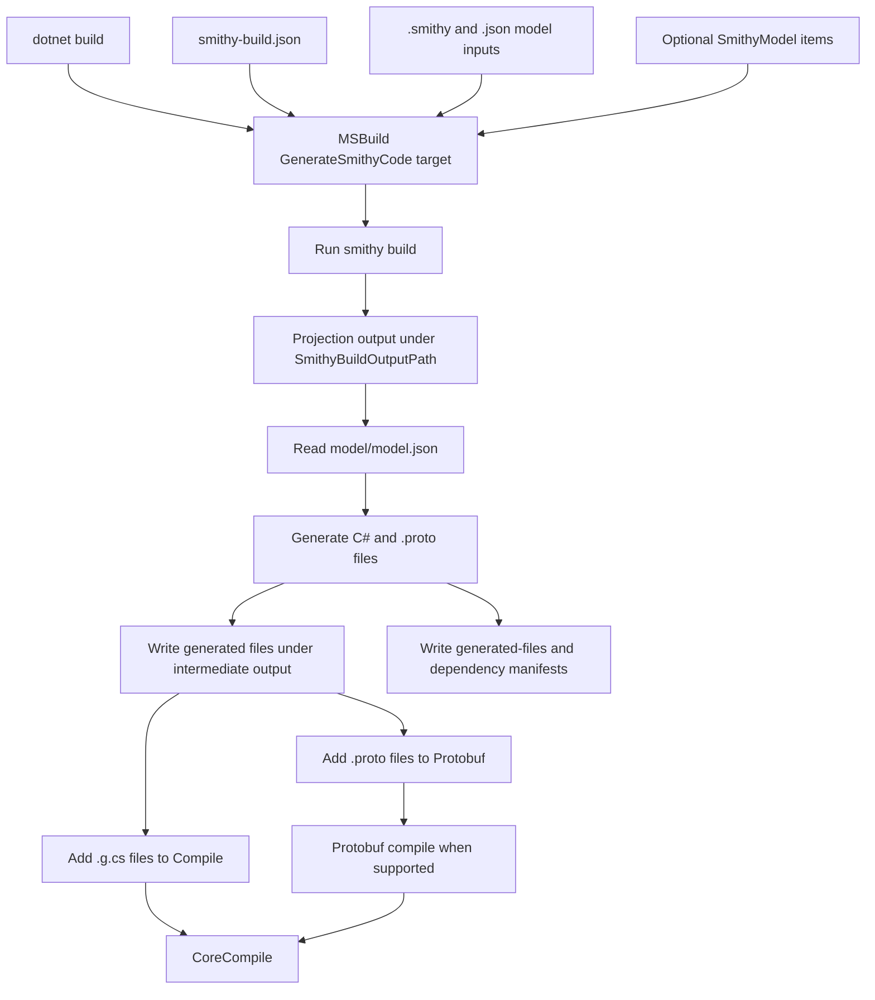

# MSBuild Reference

`SmithyNet.MSBuild` runs before C# compilation when a project has either
`@(SmithyModel)` items or a `smithy-build.json` at the project root.

The task:

1. runs `smithy build`
2. reads the selected projection's `model/model.json`
3. generates C# files under `$(SmithyGeneratedOutputPath)`
4. removes stale generated files from previous runs
5. adds the generated files to `Compile`
6. writes dependency manifests for incremental builds

## Build Flow



This diagram is intentionally simplified. It shows the main build handoff and
generated-file flow, not every manifest read, conditional target, or IDE
integration detail.

## Model Inputs

Use a `smithy-build.json` for non-trivial projects:

```json
{
  "version": "1.0",
  "sources": ["model"],
  "imports": ["vendor/common.smithy"],
  "projections": {
    "source": {}
  }
}
```

For simple projects, you can use MSBuild items instead:

```xml
<ItemGroup>
  <SmithyModel Include="model/**/*.smithy" />
</ItemGroup>
```

When `SmithyModel` items are present and `SmithyBuildFile` does not exist, the
task creates a synthetic build file under `$(SmithyBuildOutputPath)`.

## Properties

| Property | Default | Description |
| --- | --- | --- |
| `SmithyBuildFile` | `$(MSBuildProjectDirectory)/smithy-build.json` | Smithy build configuration file. |
| `SmithyProjection` | `source` | Smithy build projection to compile. |
| `SmithyGeneratedOutputPath` | `$(IntermediateOutputPath)Smithy/` | Directory for generated `.g.cs` files. |
| `SmithyBuildOutputPath` | `$(IntermediateOutputPath)SmithyBuild/` | Directory for Smithy build output and task manifests. |
| `SmithyGeneratedFileManifest` | `$(SmithyBuildOutputPath)generated-files.json` | Manifest used to delete stale generated `.g.cs` files. |
| `SmithyDependencyManifest` | `$(SmithyBuildOutputPath)dependencies.json` | JSON record of Smithy build output and model inputs. |
| `SmithyDependencyInputFile` | `$(SmithyBuildOutputPath)dependency-inputs.txt` | Newline-delimited dependency list read by later MSBuild runs. |
| `SmithyGeneratedNamespaces` | empty | Semicolon- or comma-delimited Smithy namespaces to emit. Empty means all supported shapes in the assembled model. |
| `SmithyEmitGeneratedFiles` | `false` | Marks generated compile items as visible in IDE project views when set to `true`. |
| `SmithyCliPath` | empty | Explicit Smithy CLI executable path. When empty, `smithy` is resolved from `PATH`. |

## Generated Namespace Filtering

Smithy build dependencies often include trait models such as `aws.protocols`.
Those shapes must be available to the Smithy CLI, but they usually should not be
emitted as C# in a consumer project.

Set `SmithyGeneratedNamespaces` to the API namespace or namespaces you own:

```xml
<PropertyGroup>
  <SmithyGeneratedNamespaces>example.hello;example.common</SmithyGeneratedNamespaces>
</PropertyGroup>
```

## Smithy CLI

The task expects the Smithy CLI to be provided by the build environment. The
recommended setup is to install `smithy-cli` in a managed project environment,
such as Pixi with the conda-forge package, and run `dotnet build` through that
environment. In that flow, `SmithyCliPath` can stay empty because MSBuild
inherits `PATH` and resolves the environment's `smithy` executable.

Set `SmithyCliPath` only when `smithy` is not on `PATH` or when the build needs
to force a specific executable. If the selected CLI distribution uses Java, Java
must also be available in the same build environment.
