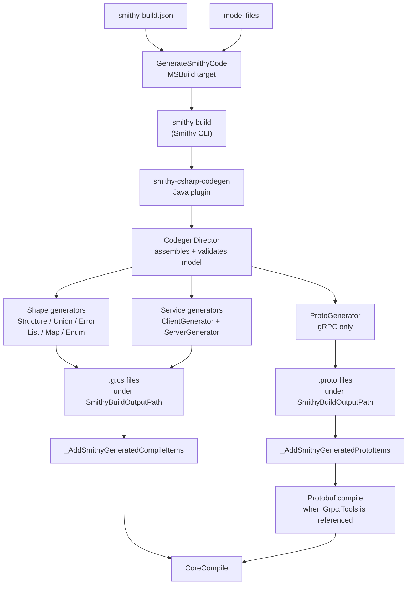

## Overview

NSmithy generates C# and `.proto` files from Smithy models using a Java Smithy
plugin (`smithy-csharp-codegen`). The plugin runs inside `smithy build` via the
Smithy CLI, which means it has direct access to Smithy's fully assembled and
validated semantic model. MSBuild invokes `smithy build` before C# compilation
and registers the generated files with the .NET toolchain.

The two sides of the architecture are:

- **Java (codegen)**: model assembly, validation, trait resolution, and C#/`.proto`
  emission all happen inside the Java plugin during `smithy build`.
- **.NET (runtime + build integration)**: `NSmithy.MSBuild` invokes `smithy build`,
  picks up the generated files, and adds them to the `dotnet build` compilation.
  The `.NET` runtime packages (`NSmithy.Core`, `NSmithy.Protocols.*`, etc.) provide
  the protocol dispatch, schema metadata, and transport abstractions that the
  generated code depends on.

## Goals

- Give consumers a `dotnet build`-first experience: no separate codegen step.
- Reuse Smithy's model front end for IDL parsing, assembly, validation, and
  trait resolution — do not reimplement these in .NET.
- Keep the generated code idiomatic C#: it should look like it was written by
  hand, not produced by a template engine.
- Support multiple protocols from a single model.
- Enable incremental builds: regenerate only when model inputs change.

## Codegen Pipeline



MSBuild picks up the generated files via two targets in `NSmithy.MSBuild`:

- `_AddSmithyGeneratedCompileItems` – adds `.g.cs` files to `<Compile>`.
- `_AddSmithyGeneratedProtoItems` – registers `.proto` files with Grpc.Tools.

## Plugin Design

### Entry point

`CSharpClientCodegenPlugin` implements `SmithyBuildPlugin`. It is discovered on
the classpath via the standard Java `ServiceLoader` mechanism using
`META-INF/services/software.amazon.smithy.build.SmithyBuildPlugin`.

When `smithy build` runs and finds a `plugins` block referencing `csharp-codegen`
in `smithy-build.json`, Smithy invokes `CSharpClientCodegenPlugin.execute()`.

### Orchestration

The plugin delegates to `DirectedCSharpClientCodegen`, which implements
`DirectedCodegen`. Smithy's `CodegenDirector` calls a method for each shape kind
in the service closure:

| Method | Generator | Output |
| --- | --- | --- |
| `generateStructure` | `StructureGenerator` | `<Shape>.g.cs` |
| `generateUnion` | `UnionGenerator` | `<Shape>.g.cs` |
| `generateError` | `ErrorGenerator` | `<Shape>.g.cs` |
| `generateList` | `ListGenerator` | `<Shape>.g.cs` |
| `generateMap` | `MapGenerator` | `<Shape>.g.cs` |
| `generateEnumShape` | `StringEnumGenerator` | `<Shape>.g.cs` |
| `generateIntEnumShape` | `IntEnumGenerator` | `<Shape>.g.cs` |
| `generateService` | `ClientGenerator` + `ServerGenerator` | `<Service>Client.g.cs`, `<Service>Server.g.cs` |
| `generateService` (gRPC) | `ProtoGenerator` | `<Service>.proto` |

All files are written under the Smithy projection's output directory:
`<SmithyBuildOutputPath>/<projection>/csharp-codegen/`.

### Symbol provider

`CSharpSymbolProvider` maps each Smithy shape to a C# `Symbol` carrying the
namespace, type name, and import list. The mapping follows the rules in
[Shape Mapping](/smithy-dotnet/design/shapes/).

### Writers

`CSharpWriter` wraps Smithy's `CodeWriter` with C#-specific helpers (namespace
blocks, using statements, XML doc comments). `CSharpDelegator` manages file
creation and routes each shape's output to the correct `.g.cs` file.

## MSBuild Integration

`NSmithy.MSBuild` is a NuGet package that provides three MSBuild targets:

### `GenerateSmithyCode`

Runs before `CoreCompile`. Executes:

```
smithy build --config <smithy-build.json> --output <SmithyBuildOutputPath>
```

Incremental: the target is only re-executed when `.smithy` or `.json` model
files (or `smithy-build.json`) change, tracked via a stamp file.

### `_AddSmithyGeneratedCompileItems`

Depends on `GenerateSmithyCode`. Adds all `.g.cs` files matching
`<SmithyBuildOutputPath>*/csharp-codegen/**/*.g.cs` to `<Compile>`.
Respects `SmithyGenerateClient` / `SmithyGenerateServer` properties to
optionally exclude client or server files.

### `_AddSmithyGeneratedProtoItems`

Depends on `GenerateSmithyCode`. Adds all `.proto` files to `<Protobuf>` with
`GrpcServices=$(SmithyGrpcServices)`. This is a no-op when `Grpc.Tools` is not
referenced.

## Configuration

`smithy-build.json` controls the codegen plugin:

```json
{
  "version": "1.0",
  "sources": ["model"],
  "maven": {
    "dependencies": [
      "io.github.thomaslaich.nsmithy:smithy-csharp-codegen:<version>"
    ]
  },
  "plugins": {
    "csharp-codegen": {
      "service": "example.hello#HelloService",
      "baseNamespace": ""
    }
  }
}
```

`CSharpSettings` carries the plugin configuration read from the `plugins` node.
The `baseNamespace` prefix is prepended to Smithy namespace segments to form C#
namespaces; an empty string means the Smithy namespace is used as-is (with
segments capitalised to PascalCase).

## .NET Runtime Packages

Generated code depends on .NET packages published to NuGet:

- `NSmithy.Core` — `Schema`, `ShapeId`, `Trait`, codec interfaces
- `NSmithy.Http` — `IHttpTransport`, `SmithyHttpRequest`, `SmithyHttpResponse`
- `NSmithy.Client` — `ISmithyClient`, `SmithyClientOptions`
- `NSmithy.Server` / `NSmithy.Server.AspNetCore` — server framework
- `NSmithy.Codecs.Json/Xml/Cbor` — codec implementations
- `NSmithy.Protocols.RestJson/RestXml/RpcV2Cbor` — protocol binding

These packages are independent of the Java plugin. A consumer project references
them in its `.csproj`; the generated `.g.cs` files import the matching types.

## Generated Code Shape

Each generated shape file contains:

1. A C# record or class for the shape (see [Shape Mapping](/smithy-dotnet/design/shapes/)).
2. A `static readonly Schema` field describing the shape's kind, traits, and
   members at runtime (see [Serialization](/smithy-dotnet/design/serialization/)).
3. Explicit `ISerializableShape` and `IDeserializableShape` implementations that
   call through to the runtime codec system.

Service files additionally contain:

- `<Service>Client` — typed async methods for each operation; binds protocol
  and transport at construction time.
- `I<Service>Handler` / `<Service>Server` — server-side handler interface and
  ASP.NET Core adapter.

## Tradeoffs

**What the Java plugin approach gives us:**

- direct access to Smithy's semantic model — no reimplementing IDL parsing,
  shape assembly, or trait resolution in .NET
- protocol correctness from Smithy's own model (trait semantics are authoritative)
- interoperability with the Smithy plugin ecosystem (transforms, projections,
  external trait libraries like `alloy`)

**What it costs:**

- the generator and its tests live in a Java/Gradle build, which is a separate
  toolchain from the .NET runtime
- backend iteration (edit generator → test generated output) involves building
  the JAR and invoking `smithy build`, which is slower than an in-process loop
- packaging and release management spans NuGet (runtime) and Maven Central
  (codegen JAR)

These costs are accepted because the Java plugin gives access to Smithy's
semantic model at the layer where model semantics are most precisely defined.

## Alternatives Considered

### Pure .NET generator reading Smithy JSON AST

An earlier design explored parsing the Smithy JSON AST in .NET and running code
generation entirely inside the .NET toolchain.

**Rejected because:**

- IDL parsing, model assembly, trait validation, and projection handling would
  all need to be reimplemented in .NET — a large maintenance surface for
  semantics that Smithy already defines authoritatively.
- Any divergence from Smithy's reference implementation would silently produce
  incorrect code.
- Direct access to Smithy's `CodegenDirector` APIs gives the plugin
  first-class trait resolution and transformation without a translation layer.

### Gradle-only workflow

Codegen could be driven by Gradle rather than MSBuild, following the pattern
used by `smithy-python` and other Smithy generators.

**Rejected because:**

- .NET developers use `dotnet build`; introducing a Gradle step would require
  them to install and understand a second build system.
- `NSmithy.MSBuild` keeps the entire developer experience inside MSBuild while
  still using the Smithy CLI (and therefore the Java plugin) for generation.

## Related Docs

- [Shape Mapping](/smithy-dotnet/design/shapes/)
- [Serialization](/smithy-dotnet/design/serialization/)
- [MSBuild Reference](/smithy-dotnet/reference/msbuild/)
